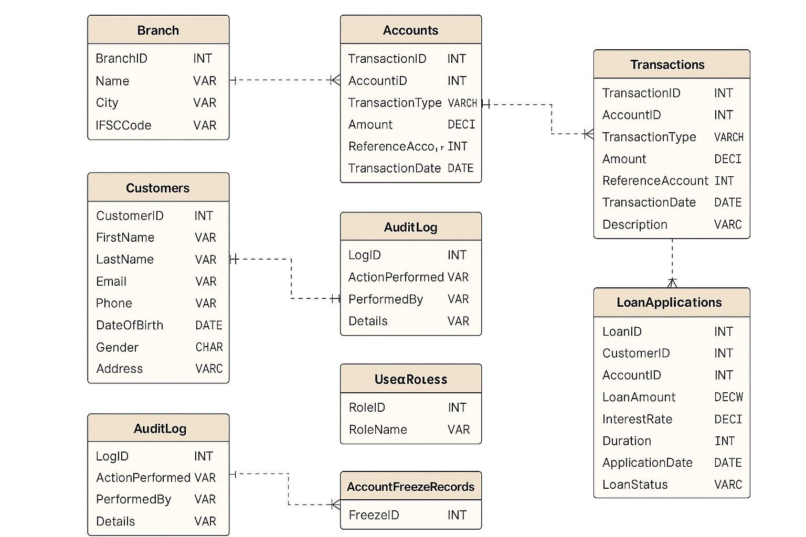

# 💼 CSI-BankingSystem-Project

> **Final Internship Project - SQL Domain**  
> 👨‍💻 **Aniruddha Sarkar** | Celebal Technologies | Summer Internship 2025

---

## 📘 Overview

The **Banking System Database Project** simulates real-world banking operations — including customer onboarding, account management, transactions, loans, and security auditing — using robust SQL design principles.  
It’s a scalable, testable, and production-ready relational schema with full procedure logic and testing scenarios.

---

## 🧱 Database Schema Design



| Table                  | Description                             |
|------------------------|-----------------------------------------|
| `Customers`            | Stores customer personal info           |
| `Accounts`             | Links to customers, tracks balances     |
| `Transactions`         | Logs all credit/debit activities        |
| `LoanApplications`     | Tracks loan application status          |
| `AuditLog`             | Stores all system actions (security)    |
| `AccountFreezeRecords` | Freezing/unfreezing recordkeeping       |
| `UserRoles` (Optional) | Scalable RBAC for future upgrades       |

---

## ⚙️ Core Features

- ✅ Create & manage customers and accounts
- 💰 Deposit, withdraw, and transfer money
- 🧾 Full transaction history & insights
- 🧠 Monthly statements & reporting
- 🔐 Security with audit logging & freeze status
- 🚫 Edge case handling with graceful failures
- 📊 Fully testable with large datasets

---

## 💾 Technologies Used

| Tool / Platform               | Purpose                       |
|-------------------------------|-------------------------------|
| Microsoft SQL Server          | Database engine               |
| SSMS (SQL Server Mgmt Studio) | Development & testing         |
| GitHub                        | Version control & publishing  |
| DrawSQL / Canva               | ER diagram design             |

---

## 🧪 Testing Summary

| Type                          | Coverage                      |
|-------------------------------|-------------------------------|
| Functional                    | 9 test cases (TC01-TC09)      |
| Edge Cases                    | 7 Scenarios (EC01-EC07)       |


Test results and outputs are available in the [Outputs](./Outputs/) folder.

---

## 🔒 Security & Audit Highlights

| Feature                | Implementation Detail               |
|------------------------|-------------------------------------|
| Audit Logging          | `AuditLog` table + SP tracking      |
| Account Freezing       | `AccountFreezeRecords` checks logic |
| Role Access (Optional) | `UserRoles` table for RBAC          |
| Validation & Integrity | PK, FK, and constraint enforcement  |

---

## 📁 Folder Structure

```
CSI-BankingSystem-Project/
├── SQL/
│   ├── 1_Table_Definitions
│   ├── 2_Sample_Data_Inserts
│   ├── 3_Stored_Procedures
│   ├── 4_Views_and_Triggers
│   ├── 5_Testing_Cases
│   ├── 6_Mass_Transactions
│   └── 7_Edge_Case_Scenarios
│
├── Documentation/
│   ├── ER_Diagram.png
│   ├── Schema_Explanation.pdf
│   ├── StoredProcedures_Explanation.pdf
│   ├── Testing_Summary.pdf
│   └── AuditLog_and_Security_Model.pdf
│
├── Outputs/
│   ├── All outputs of different SQL Queries...
│
├── Project Report/
│   └── Complete_Banking_System_Project_Report_Aniruddha.pdf
│
└── README.md
```

---

## 📄 Documentation & Report

| Document                            | Link                                                                       |
|------------------------------------ |----------------------------------------------------------------------------|
| Full Report PDF                     | [Click Here](./Project_Report/Complete_Banking_System_Project_Report_Aniruddha.pdf) |
| Schema Explanation                  | [View PDF](./Documentation/Schema_Explanation.pdf)                          |
| Stored Procedures Explained         | [View PDF](./Documentation/StoredProcedures_Explanation.pdf)               |
| Testing Summary                     | [View PDF](./Documentation/Testing_Summary.pdf)                            |
| Audit & Security Model              | [View PDF](./Documentation/AuditLog_and_Security_Model.pdf)                |

---

## 🚀 Live Highlights

- ✅ Project tested on large datasets
- ✅ All procedures successfully validated
- ✅ Organized folder structure
- ✅ PPO-ready presentation document

---

## 🙌 Author & Contact

👤 **Aniruddha Sarkar**  
📧 aniruddhasarkar811@gmail.com  
📞 8116253439  
🎓 Techno Main Salt Lake | SQL Intern at Celebal Technologies

---

> _“Secure. Scalable. Structured — A Complete SQL Banking System for the Future.”_

⭐ If you found this project insightful, don't forget to **star** the repo!
